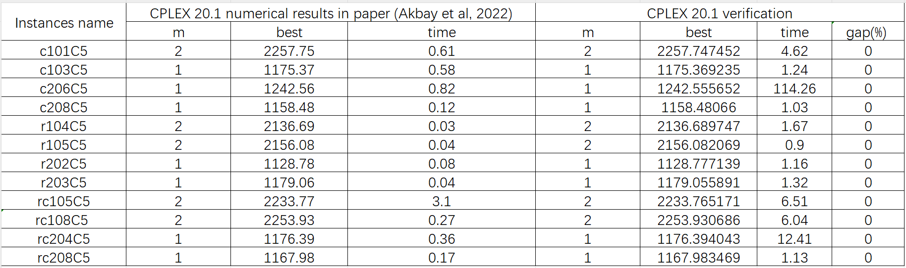

# EVRP-TW-SPD
Dataset, CPLEX code of the Electric Vehicle Routing Problem with Time Windows, Simultaneous Pickup and Deliveries (EVRP-TW-SPD) based on the paper titled *["Application of CMSA to the Electric Vehicle Routing Problem with Time Windows, Simultaneous Pickup and Deliveries, and Partial Vehicle Charging"](https://doi.org/10.1007/978-3-031-26504-4_1)* (Akbay et al, 2022).

We generate EVRP-TW-SPD dataset and CPLEX 20.1 verification.

## EVRP-TW-SPD dataset generation

As states in the paper of Akbay et al (2022), EVRP-TW-SPD dataset is generated based on the EVRP-TW problem instances introduced by the paper titled *["The electric vehicle-routing problem with time windows and recharging stations"](https://doi.org/10.1287/trsc.2013.0490)* (Schneider et al, 2014),  where the delivery demand of each customer was separated into a delivery and a pickup demand by using the approach from the paper titled *["A cluster insertion heuristic for single and multiple depot vehicle routing problems with backhauling"](https://link.springer.com/article/10.1057/palgrave.jors.2600808)* (Salhi et al, 1999). EVRP-TW-SPD dataset instances generator is implemented in Python.

## CPLEX 20.1 verification

To verify the correctness of EVRP-TW-SPD dataset generation, we give CPLEX code to compare its verification results with corresponding numerical results in the paper of Akbay et al (2022). For simplicity, this CPLEX code is base on [Github repo](https://github.com/0SliverBullet/E-VRPTW), where we **set three copies as dummy vertex** for each charging station in .dat files. Verification were performed on a Personal Computer with 11th Gen Intel (R) Core (TM) i5-1135G7 CPU with 8 cores of 2.40GHz and a minimum of 16 GB RAM. CPLEX version 20.1 was used in one-threaded mode, the same as the configuration in the paper of Akbay et al (2022).

Computational results of CPLEX 20.1 verification for small-sized instances with 5 customers are shown as follows:

where *m* denotes the vehicle number, *best* denotes the optimal objective values, *time* denotes the total run-time in seconds, *gap* is calculated as $\frac{best_{\text{in paper}}-best_{\text{in verification}}}{best_{\text{in paper}}}\times 100 \%$. 

CPLEX 20.1 verification conclusion: computational results in the EVRP-TW-SPD dataset generated using Akbay et al.'s (2022) approach **align with** those of the dataset actually used in the same paper, indicating the correctness of the EVRP-TW-SPD dataset generation.

## References

- Akbay, M. A., Kalayci, C. B., & Blum, C. (2022). Application of cmsa to the electric vehicle routing problem with time windows, simultaneous pickup and deliveries, and partial vehicle charging. In *Metaheuristics International Conference* (pp. 1-16). Cham: Springer International Publishing.
- Schneider, M., Stenger, A., & Goeke, D. (2014). The electric vehicle-routing problem with time windows and recharging stations. *Transportation science*, *48*(4), 500-520.
- Salhi, S., & Nagy, G. (1999). A cluster insertion heuristic for single and multiple depot vehicle routing problems with backhauling. *Journal of the operational Research Society*, *50*, 1034-1042.
